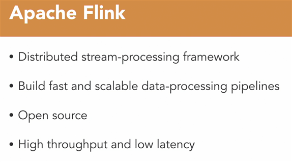
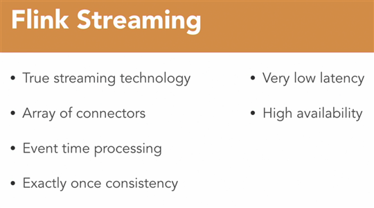

# Apache Flink

- Link: https://www.linkedin.com/learning/apache-flink-real-time-data-engineering/real-time-processing-and-analytics
- Professor: [Kumaran Ponnambalam](https://www.linkedin.com/learning/instructors/kumaran-ponnambalam)

## Referencias
- https://flink.apache.org/
- https://medium.com/@priyankbhandia_24919/apache-flink-for-data-enrichment-6118d48de04

## O que é

Uma plataforma de processamento de dados distribuída e de código aberto, projetada para processar fluxos de dados em tempo real e em lotes.
> pode ser dimensionado horizontalmente
- fornece agendamento de trabalho
- atribuição de recursos
- processamento paralelo
- confiabilidade
- pode rodar e um single node ou em um cluster

> Criado para criar pipelines até terabytes de dados

>Compete com o Spark, Samza, Storm e outros. 

## Desafios com processmento em Stream

- Dados não limitados (Unbounded data)
    - Não é possível saber o total de registro a partir de qualquer ponto do processo
- Chegada de novos dados em intervalos imprevisíveis
- Dados novos não são repetíveis (resultados diferentes para a mesma consulta realizada em tempos diferentes)
- Resultados das consultas expiram rapidamente (precisam ser reexecutados)
- Gerenciamento de estado (open/close, ativo/inativo, etc)
    - ex. usuário navegando no site, precisa-se manter o controle do estado do usuário como parte da consulta de analise (quanto tempo o usuário está ativo no site).
- Latencia entre os nodes de origem e os nodes de análise
    - latencia alta pode afetar a validade dos resultados
- Requisitos de recursos
    - Hardware
    - Largura de Banda Rede
    - Storage

## Por que o Flink?

- processa sem o uso de **microbatches**.
- Vários tipos de conectores com fontes coletaoras de streaming (HDFS, Kafka, Amazon Kinesis, RabbitMQ, Google PubSub e Cassandra)
- Processamento com base em carimbos (timestamp)
    - Acumula eventos com base em carimbos de data/hora antes de executar o processamento.
- **Exactly-once semantics** é uma garantia fornecida por sistemas de processamento de dados distribuídos como o Flink, onde cada evento é processado exatamente uma vez. Isso significa que, independentemente de falhas ou reinicializações, o estado do sistema refletirá exatamente uma única execução de cada evento. 
    - O programador não precisa se preocupar com isso.

# APIs De Fluxo De Dados
- API de processamento de fluxo de alto nível.
- Cria e usa objetos DataStream para dados ilimitados.
- Suporta operações do tipo map e reduce.
- Suporte para Janelas.
- Suporte processamento de tempo de evento (permite o uso de carimbos).
- Gerenciamento de estado.

