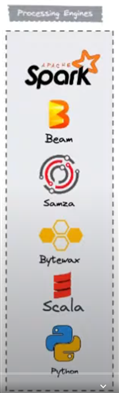

# Apache Flink - Glossario

- **Actor Sytem**: refere-se ao uso do modelo de atores para gerenciar a comunicação assíncrona e concorrente entre diferentes componentes do sistema. Esse modelo é particularmente útil em sistemas distribuídos, onde a comunicação entre componentes precisa ser eficiente, resiliente e escalável.

- **Apache Flink**: Uma plataforma de processamento de dados distribuída e de código aberto, projetada para processar fluxos de dados em tempo real e em lotes.
- **Batch Processing (Processamento em Lote)**: Processamento de grandes volumes de dados agrupados (lotes) de uma só vez.
- **Checkpointing (Pontos de Verificação)**: Mecanismo de recuperação de falhas do Flink que salva periodicamente o estado do aplicativo para garantir a consistência dos dados.
- **Cluster**: Um conjunto de máquinas que trabalham juntas para executar trabalhos do Flink.
- **Connector (Conector)**: Componentes que permitem ao Flink interagir com sistemas externos, como Kafka, HDFS, JDBC, etc.
- **DataSet API**: API do Flink usada para processar dados em lote.
- **DataStream API**: API do Flink usada para processar fluxos de dados.
- **Event Time (Tempo de Evento)**: O timestamp associado a cada evento, representando o momento em que o evento ocorreu.
- **Execution Graph**: Representação detalhada de um trabalho do Flink durante a execução, incluindo tarefas e seus estados.
- **Flink Runtime**: O ambiente de execução do Flink responsável por gerenciar a distribuição e execução dos trabalhos.
- **Flink SQL**: Interface SQL do Flink para consulta e análise de fluxos de dados.
- **Job (Trabalho)**: Uma unidade de processamento enviada para o cluster do Flink, composta por um ou mais operadores.
- **Job Graph**: Representação interna de um trabalho do Flink, descrevendo a topologia de operadores e suas conexões.
- **Job Manager**: Componente do Flink responsável por coordenar a execução de um trabalho, gerenciando recursos e supervisionando tarefas.
- **keyBy**: é uma função utilizada para particionar um fluxo de dados em sub-fluxos com base em uma chave. Isso significa que todos os elementos com a mesma chave serão encaminhados para a mesma instância de operador, permitindo operações estado-centradas, como agregações, janelamentos ou junções, de serem realizadas com precisão.
- **Operator (Operador)**: Uma função ou transformação aplicada aos dados, como map, filter, window, etc.
- **Parallelism (Paralelismo)**: O número de sub-tarefas em que uma tarefa pode ser dividida, permitindo a execução simultânea.
- **Processing Time (Tempo de Processamento)**: O timestamp no momento em que um evento é processado pelo sistema.
- **Queryable State (Estado Consultável)**: Funcionalidade que permite consultar o estado de um aplicativo Flink em execução.
- **RocksDB**: RocksDB é uma biblioteca de armazenamento embutida, desenvolvida pelo Facebook, que é usada para armazenamento eficiente de dados em disco. No contexto do Apache Flink, RocksDB é frequentemente usado como um backend de estado para armazenar o estado de operadores de forma persistente e eficiente.
- **Savepoint**: Um snapshot manual do estado de um trabalho do Flink que pode ser usado para reiniciar o trabalho a partir de um estado consistente.

- **Sink**: Componente do Flink que escreve dados processados para um destino externo, como um sistema de arquivos ou um banco de dados.

- **Source (Fonte)**: Componente do Flink que lê dados de uma origem externa, como um banco de dados ou uma fila de mensagens.
- **State (Estado)**: Dados mantidos pelos operadores do Flink durante o processamento de fluxos de dados.
- **State Backend (Backend de Estado)**: Subsistema no Flink que gerencia a persistência do estado, como RocksDB ou memória. State Backend no Flink refere-se ao mecanismo utilizado para gerenciar e persistir o estado dos operadores durante o processamento de dados. Existem dois principais state backends no Flink: MemoryStateBackend e RocksDBStateBackend.
- **Stream Processing (Processamento de Fluxo)**: Processamento contínuo de dados em movimento, onde os dados são processados imediatamente à medida que chegam.
- **Task (Tarefa)**: A unidade mais básica de execução dentro de um trabalho do Flink.
- **Task Manager**: Componente do Flink que executa tarefas individuais em um cluster, gerenciando threads e memória.
- **Transformation (Transformação)**: Operações aplicadas aos dados dentro de um fluxo, como map, flatMap, filter, etc.

- **Unbounded Data**: refere-se a fluxos de dados contínuos que não têm um início e um fim predefinido. Esses fluxos de dados são gerados continuamente a partir de várias fontes, como sensores IoT, logs de servidor, transações financeiras, entre outros, e precisam ser processados em tempo real à medida que chegam.
- **Watermark**: Sinal utilizado para indicar o progresso do tempo de evento em um fluxo de dados, ajudando a gerenciar a latência e a precisão no processamento de janelas.
- **Windowing (Janelamento)**: Técnica para agrupar fluxos de dados em intervalos de tempo ou contagem de eventos para processamento.

# Windows

- **Custom window**: Se refer á uma janela personalizada, com lógica definida pelo usuário para os limites de janela (*limit bound*).

- **Global window**: conta todo o fluxo com uma única janela.

- **Session window**: janela de sessao cobre todos os eventos que ocorrem continuamente em uma sessao. Os limites de uma sessão são baseados em períodos de inatividade. Imagine um IOT que para de enviar mensagens durante um curto período de tempo, isso fecha uma janela de sessão.
- **Sliding window**: é uma técnica de sobreposição de janelas. Ex. Janela 1 do minuto 0 ao minuto 2, Janela 2 do minuto 1 ao minuto 3, etc.

- **Tumbling window**: é uma técnica útil em processamento de streams para agrupar e processar dados em intervalos de tempo fixos e não sobrepostos. Eles são amplamente usados em cenários onde a simplicidade e a clareza na agregação de dados em períodos regulares são necessárias. No entanto, para análises mais complexas ou para lidar com dados de forma contínua, outras técnicas de janelas, como sliding windows, podem ser mais apropriadas.

# Semanticas 

- **Exactly-once semantics**: é uma garantia fornecida por sistemas de processamento de dados distribuídos como o Flink, onde cada evento é processado exatamente uma vez. Isso significa que, independentemente de falhas ou reinicializações, o estado do sistema refletirá exatamente uma única execução de cada evento.
- **At-least-once Semantics**: Garante que cada evento seja processado pelo menos uma vez, mas permite duplicações.
- **At-most-once Semantics**: Garante que cada evento seja processado no máximo uma vez, podendo perder eventos em caso de falhas.

## Engines de processamento concorrentes ao Flink

- Spark não tem gerenciamento de estado (tem que ser desenvolvido). Inicialmente feito para processamento em batch, depois adaptado para stream.
- Apache Beam, ainda em tracionamento (evolução).
- Bytewax - Python mas não maduro o suficiente
- Scala/Python, vou ter que desenvolver o gerencimaneto de estado (reinventar a roda).

