# Ref

## Arquitetura
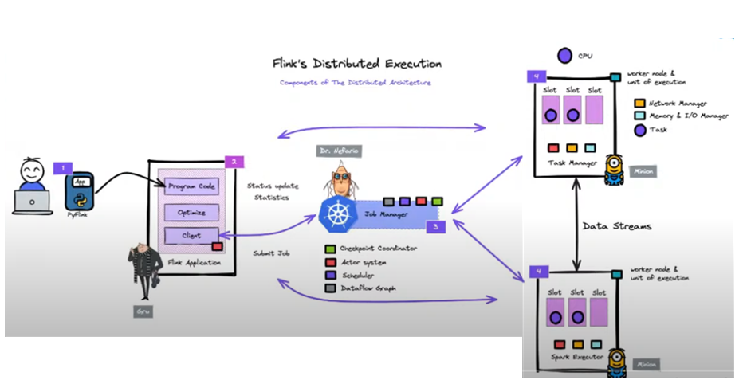

- aplicação usando pyflink
- Actor system está na aplicação, job manager e no task manager.
- Network manager, trafega informações entre os nodes task manager.

## Anatomia de transformação

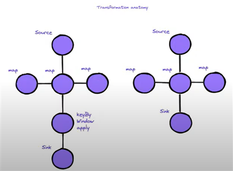

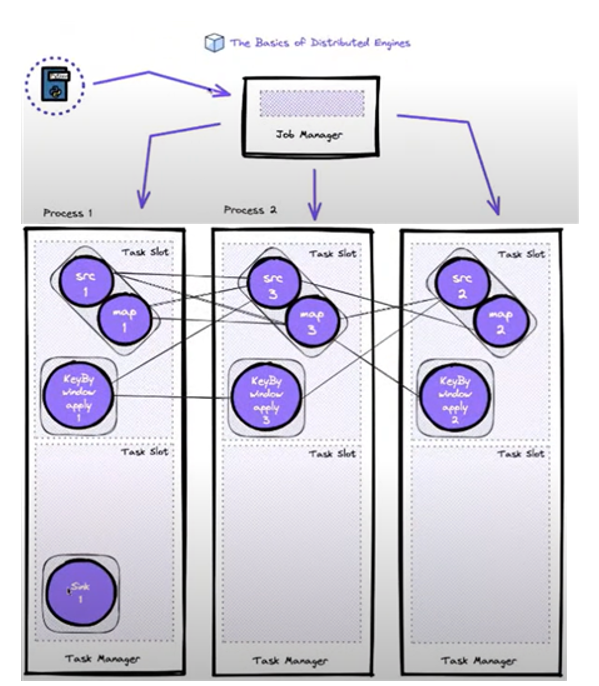

## APIs Flink
> A comunidade esta trabalhando forte para a camada SQL.
>
> Geralmente se trabalha no Core API, Declarative DSL e SQL.
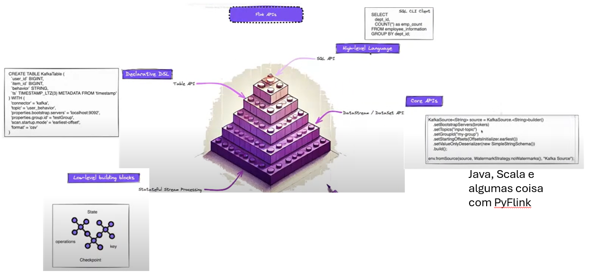

## 

> Neste desenho, o Kafka foi retirado pois o Flink CDC faz a conexão direata com o banco (nativamente), não precisando deste caso de um Kafka. O Flink faz todo o processamento e armazena os resultados no Table Store.
>
> O Iceberg/Trino estão sendo usados para armazernar o Table Store.

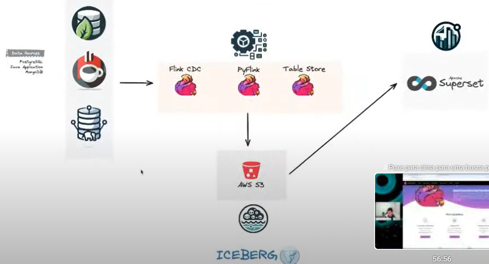

# Video 2

Conceitos de Streaming **Unbounded** e **Bounded** Data.
- limitar os dados dentro de uma janela, a não ser que seja necessario processar evento por evento (janela 1?). 

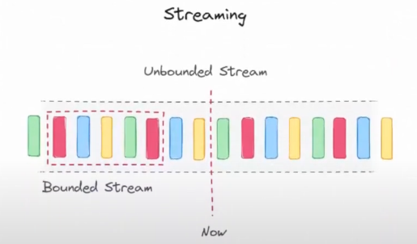

## Window

Tumbling Window

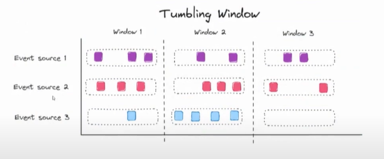

Sliding Window

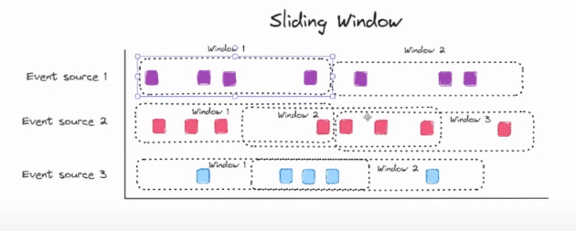

Cumulative Window

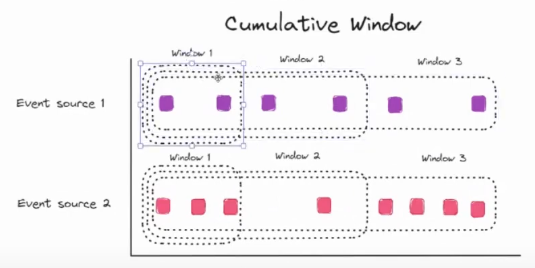

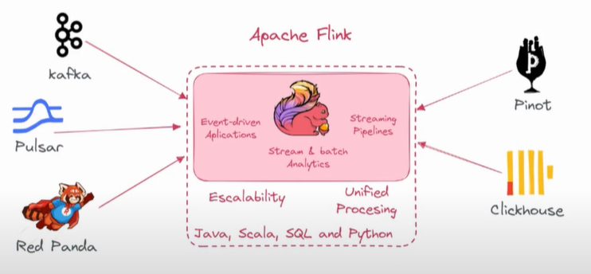

## Arquitetura

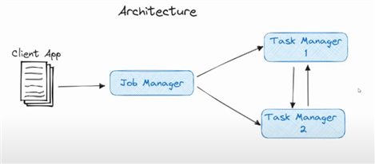

## Job Graph
> Acho que tem haver com a  Anatomia de transformação exibido a cima;

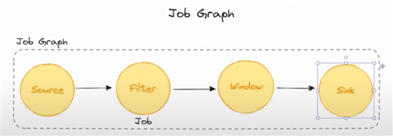

## Flink Api
> Consegue definir um tempo de retenção de dados e screenshots

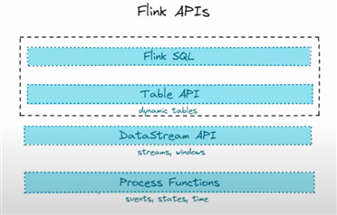
